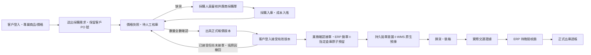

# Corely ERP 進銷存：第一階段實作與切換順序

建立：2026-09-23；狀態更新：2026-09-24。資料主權：**Corely ERP 管正式庫存帳**；WMS 管實物揀貨、裝箱與交運證據；ECOUNT 僅供查詢或經核准的會計用途。ERP 客戶入口及庫存基礎功能已在共用 DEV 驗證；正式報價、缺貨採購、獨立採購入口與 ERP 簽章 WMS 工作台，已在新的隔離 0% 候選完成一筆合成訂單的完整 1＋1 交運與核銷試跑，詳細收據見 `ERP_B2B_WORKBENCH_DEV_QA_2026-09-24.md`。共用 DEV 100% 尚未切換，因真實商品／WMS 品牌與具名 grant 尚無可審核對照，且持續交運發送器須以正式 DEV 網址部署。**正式環境及實體倉儲流程尚未驗收。**

## 單據與狀態

各節點已有程式，驗證階段不同：客戶入口、需求送出、人工核庫、接單預留及採購成本在 DEV 基礎版本驗證；正式報價、客戶接受、撤回重核及來源關聯缺貨採購在隔離候選完成試單；新配對候選再完成 ERP 工作台揀裝、兩筆部分交運、ACK、人工核銷與重播不重扣。仍需真實商品與員工映射、共用 DEV 切流、實際倉管／物流驗收及正式環境切換。裝箱完成不能充當交運或正式扣庫。對 WMS 管理的銷單，ERP 原有「整張銷單立即出庫」入口已加阻擋，正式出庫必須經交運證據與人工核銷。

| 單據／數量 | 建立時點 | 負責系統 | 已實作邊界 |
|---|---|---|---|
| 客戶採購需求／價格快照 | 客戶送出 | ERP | 保留客戶 PO 號、SKU、價格、稅額和提交冪等鍵；只供該客戶登入檢視；需求本身**不是**正式報價 |
| 人工核庫結果 | 業務或倉管確認 | ERP | 記錄逐行可供量、核對人、時間、交期與差異說明；不先扣庫 |
| 正式銷售報價／接受 | 全數核庫後由業務出具；客戶登入接受 | ERP | 建立 `SalesQuotation` 與不可改寫版次，保存雙方名稱／統編、品項、價格、稅額、有效期與交期快照；只有最新有效版本可接受；接受記錄客戶帳號與時間 |
| 撤回已接受報價 | 未接單時由業務填原因 | ERP | 原版保留撤回狀態／原因，需求回待核庫；重新人工核庫後才能出新版，不能沿用原接受紀錄 |
| 缺貨來源關聯採購 | 核庫不足後由採購人員建立 | ERP | 依需求行、供應商、成本及未收採購量限制新單；已收或取消採購不占未收缺口，收貨後須重新核庫才能再採購 |
| 正式銷單與預留 | 客戶接受最新版後由業務確認接單 | ERP | 再次檢查全數核庫、有效接受與庫存；一筆 DB 交易內建單與預留，庫存不足全部回滾 |
| 拋單與預揀工作單 | 出貨人員送倉 | ERP→WMS | 保留 ERP 拋單意圖與原請求 ID；WMS 檢查來源逐商品數量、ERP 預留證據與簽章 |
| 實際交運與待核銷 | 倉庫確認交給物流或客戶 | WMS→ERP | WMS 保存箱件、數量、物流／提貨證據及持久 outbox；ERP 以獨立認證接收後，只建待人工核銷紀錄，不扣帳面庫存 |
| 正式出庫 | 人員逐行核對並核准 | ERP | 原交易內釋放該行預留、寫正式 OUT 及唯一過帳收據；可分次過帳，重送不重複扣庫 |
| 收貨運費試算 | 採購單收貨前 | ERP | 逐明細計費重量 × 每公斤費率 × 匯率，按重量分攤到貨品，保存操作人與成本快照 |
| 正式採購入庫成本 | 採購收貨 | ERP | 入庫與移動平均成本在同一交易；已保存的**暫估**運費計入成本，尚不產生實際運費會計憑證 |

## 本次可操作的入口

- 客戶：`/b2b/login`、`/b2b/catalog`、`/b2b/requests`、`/b2b/requests/:id`。客戶帳號與員工帳號分離；LINE 由業務自行貼受登入保護的連結，不自動發訊。
- 業務：`/sales/b2b` 管理客戶帳號、發布商品、客戶專屬價、需求核庫、正式報價版次、撤回重核與確認接單。LINE 連結由人員複製並自行傳送，沒有自動訊息。
- 採購：`/purchasing/b2b-shortages` 獨立列出已核庫缺貨需求，只顯示需求號、SKU、品名與數量，不提供客戶帳號或銷售價格；具採購建立權限者選供應商、數量、成本建立來源關聯單。`/purchasing/supplier-accounts` 為供應商帳號管理入口，支援查看、建立、停用及重設密碼，依採購讀／建權限分別控管；**供應商登入及採購單自助查詢尚未開放**。
- 收貨與成本：既有 `/purchasing/orders` 增加每行重量與運費試算／保存。`POST /purchase-orders/:id/landed-cost/preview` 只試算；`PUT /purchase-orders/:id/landed-cost` 在未收貨時保存，收貨後唯讀。已收的關聯採購不再占缺口，但若收貨晚於上次核庫，新增關聯採購須先由業務重核庫。
- 出貨：ERP 的「訂單拋轉」送至 WMS 原生接單 API。成功回執含預揀單、WMS 工作單與 WT 工作條碼；ERP 可連到 WMS `/corely-intakes/:id`。WMS 交運頁可保存實交數量與箱件證據，ERP `/inventory/handover-reconciliation` 逐行人工過帳。這條跨系統流程已做配對 DEV 合成試驗，仍未切入 WMS 穩定入口或實體倉儲營運。
- 既有一般單據：`/sales/quotations` 仍可獨立建一般報價，`/purchasing/orders` 可獨立建一般採購單。B2B 正式報價須由 `/sales/b2b` 出具並由客戶本人登入接受；來源關聯採購須從缺貨流程建立，不能把一般單據當成客戶接受或缺口核銷證據。

第一版客戶入口限 TWD／5% 稅率與一般商品。出具正式報價及確認接單前驗證商品條碼、非 SN 商品及同品牌 WMS 對照；資料缺漏時拒絕，不留下無法送倉的預留。數量不符時保存差異，與客戶協調供貨並重新人工核庫；原需求品項或價格要改，應請客戶送新需求。業務只能在已接受且未建銷單時填原因撤回，原連結仍可查歷史但不得再次接受，必須重核庫並出新版。LINE 沒有自動通知；供應商帳號未開放登入及查採購單。

## 進貨成本的具體口徑

每張採購單在第一次收貨前保存一次運費暫估。人員輸入各行**本次計費重量 kg**、運費幣別、原幣每公斤費率及換算公司本位幣的匯率。系統先算總運費，再按行重量比例分配；小數尾差按最大餘數分到明細，確保每行分攤加總等於總運費。收貨時以「商品本幣採購額＋行運費」更新移動平均成本；同 SKU 在一張單出現多行會合併計算，避免重複計價。估算記錄有建立／更新人及套用時間。

這一版不含一批海運合併多張 PO、分批到貨、材積重與最低收費、報關／關稅分攤、實際運費憑證及差額調整，也不把暫估直接當付款或可扣抵稅。這些要進下一版的「運輸批次＋收貨批次＋實際費用調整」模型。

## 交運與晚間核銷：目前實作及邊界

WMS 原生交運已在候選程式中保存來源訂單與行 ID、實際交運數量、SKU、箱號、物流或客戶提貨證據、操作人、時間及事件 ID；裝箱與交運是不同節點。持久 outbox 以原事件 ID 重送。ERP 驗證已確認的拋單、來源、權限、預留和逐行數量，將事件保存為待核銷；收到回執時**正式帳面尚未扣減**，可售量仍受原預留限制。此版交運限非 SN 一般商品；SN／批號交運核銷仍需後續設計與驗收。

ERP 工作台可按交運日、狀態與訂單／事件／SKU 搜尋，讓人員逐行比對箱件、實交量與銷單餘量。核准時以**出貨明細 ID** 的唯一收據，在同一交易中釋放該量預留、扣帳面庫存並寫流水；分次交運只過帳已核准數量，剩餘量仍保留預留，同一行重送不二次扣庫。這是逐行人工核銷，尚未提供整日晚間批次核准、專用差異佇列、剩餘預留取消／釋放或已過帳沖銷／退貨流程。

ERP 出貨明細、不可改寫的交運 inbox、過帳收據與 WMS outbox／簽章回傳均已在候選程式中。配對 DEV 候選維持 0% 流量；合成 60＋40 分次交運、重播不重扣及兩次人工過帳已驗證，實際倉管操作、錯品／併發／丟 ACK 等例外與正式環境仍待驗收。

## 尚待補齊的營運閉環

1. **報價及採購擴大驗收**：隔離 DEV 已驗證正式報價版次、客戶接受、撤回後重核、新版與接單，以及來源採購與收貨後重新核庫；後續還需真實客戶／供應商資料、缺貨分批採購、有效期邊界、多人併發及業務／純採購角色的持續驗收。客戶拒絕報價的獨立動作、報價原單編修與自動 LINE 通知尚未提供。
2. **進貨與成本後續**：支援運輸批次、多 PO／分批到貨、材積或最低收費、關稅與實際運費差額及經核准的會計憑證；目前的暫估運費只入移動平均成本，沒有實際運費分錄。供應商登入與自助查採購單仍待設計。
3. **倉儲例外與對帳**：補整日批次審核、差異處理、未交餘量取消、退貨／沖銷及 SN／批號追溯，再做現場掃碼、列印、物流交接與倉管夜間核對驗收。

## 上線順序與驗收

1. **DEV 基礎版本已部署**：ERP API `corely-erp-api-dev-b2b-a75132f0b6b3-c`、web `corely-erp-dev-b2b-a75132f0b6b3-f` 各接 100% DEV 流量；三項 ERP migration `20260923080000_b2b_customer_portal`、`20260923090000_purchase_landed_cost`、`20260923100000_wms_handover_reconciliation` 已在 DEV 套用並核對。合成資料已驗證客戶 A/B 隔離、登入、專屬價、提交需求、人工核庫、採購收貨與暫估運費成本。這不等於正式使用者驗收。
2. **配對 WMS 合成試驗已完成**：ERP API `corely-erp-api-dev-pairfix-a75132f0-0923`、web `corely-erp-dev-pair-a75132f0-0923` 為 0% 流量標記候選；WMS 測試採 `corely-wms-dev-pair-a75132f0-0923-config`，測試後標記改指向關閉命令與發送的 `corely-wms-dev-pair-a75132f0-0923-retired`。穩定 WMS `corely-wms-dev-entry-audit2-0923` 仍接 100% DEV 流量。合成銷單 `95ceaf03-1b4f-43f3-84dd-511ec0b0c7c4` 預留 100 件，原請求重送仍只得一張 WMS 工作單；三種倉庫角色完成預揀、揀貨、裝箱、60＋40 交運。WMS outbox 僅兩筆事件，兩筆均獲 ERP ACK；ACK 前帳面維持在庫 100／預留 100，人工逐行核銷後為 40／40、0／0，正式 OUT 僅兩筆 60＋40。兩筆成本以每件 30 元過帳為 1,800／1,200 元；過帳重送未再次扣庫。專用發送 worker 已建立關閉版並刪除原啟用 revision，唯讀複核確認不存在啟用 sender，穩定服務仍為 100% 原 revision。這些數據均為合成 DEV 試驗，沒有實物出貨。
3. **正式報價與缺貨採購候選**：需求來源的 `SalesQuotation` 版本／客戶接受／未接單撤回、來源關聯採購單、獨立缺貨採購與供應商帳號管理頁，已和 ERP 簽章 WMS 工作台完成 0% 配對合成試跑。共用 DEV 100% 尚不可切：B2B 已上架商品及唯一 WMS 品牌 grant 都是 QA 資料，沒有可採信的真實商品→WMS 品牌對照；WMS 候選也沒有持續發送器。先核對真實客戶／供應商主檔、價格、SKU 條碼、公司與倉庫、品牌對照及具名員工 grants，再建立唯一常駐 sender 並按切流／回滾守衛驗證，不依 Email 或姓名自動對應。
4. **擴大驗收**：除合成 60＋40 外，還需測重複事件／丟 ACK、跨日、錯品或逾額、兩人併發、失敗回滾、舊 ERP／ECOUNT 來源切換與退貨；最後在現場驗收實際掃碼、列印、交運與晚間核對。DEV 與正式需各自保留部署及核銷證據。

設定至少需 `B2B_PORTAL_ENABLED=true`、`WMS_HANDOVER_ENABLED=true`、ERP→WMS 的 URL／RS256 金鑰與 issuer/audience、WMS 的 ERP 公鑰／明確 grants，以及 ERP SKU→WMS 品牌對照；使用既有密鑰流程，不把金鑰寫入程式庫。WMS 原生 migration 與 ERP migration 須分別核對 checksum 與資料庫版本。DEV、正式、歷史切換及實體驗收各自出具證據，不以本機 build、0% 候選或合成測試代替。
