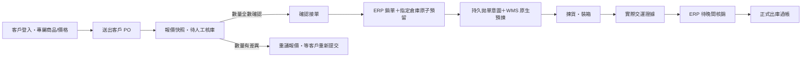

# Corely ERP 進銷存：第一階段實作與切換順序

日期：2026-09-23。資料主權：**Corely ERP 管正式庫存帳**；WMS 管實物揀貨、裝箱與交運證據；ECOUNT 僅供既有查詢及經核准的會計資料。此文件描述本機實作與下一階段，不表示 DEV 或正式環境已上線。

## 單據與狀態

本次已形成 A→G 的本機程式切片；H→J 尚未建置。裝箱完成不能充當交運或正式扣庫。對 WMS 訂單，ERP 原有「整張銷單立即出庫」入口已加阻擋，避免繞過晚間核銷；因此完整出貨仍須等 H→J 完成並驗收。

| 單據／數量 | 建立時點 | 負責系統 | 已實作邊界 |
|---|---|---|---|
| 客戶採購需求／報價快照 | 客戶送出 | ERP | 保留原客戶 PO 號、SKU、價格、稅額和提交冪等鍵；只供該客戶登入檢視 |
| 人工核庫結果 | 業務或倉管確認 | ERP | 記錄逐行可供量、核對人、時間、交期與差異說明；不先扣庫 |
| 正式銷單與預留 | 人員確認接單 | ERP | 只准全數確認的需求；一筆 DB 交易內建單與預留，庫存不足全部回滾 |
| 拋單與預揀工作單 | 出貨人員送倉 | ERP→WMS | 保留 ERP 拋單意圖與原請求 ID；WMS 檢查來源逐商品數量、ERP 預留證據與簽章 |
| 收貨運費試算 | 採購單收貨前 | ERP | 逐明細計費重量 × 每公斤費率 × 匯率，按重量分攤到貨品，保存操作人與成本快照 |
| 正式採購入庫成本 | 採購收貨 | ERP | 入庫與移動平均成本在同一交易；已保存的**暫估**運費計入成本，尚不產生實際運費會計憑證 |

## 本次可操作的入口

- 客戶：`/b2b/login`、`/b2b/catalog`、`/b2b/requests`、`/b2b/requests/:id`。客戶帳號與員工帳號分離；LINE 由業務自行貼受登入保護的連結，不自動發訊。
- 員工：`/sales/b2b` 管理外部帳號、發布商品、客戶專屬價、需求核庫與確認接單。供應商帳號可建檔、停用及重設密碼，**供應商入口尚未開放**。
- 採購：既有採購單頁增加每行重量與運費試算／保存。`POST /purchase-orders/:id/landed-cost/preview` 只試算；`PUT /purchase-orders/:id/landed-cost` 在未收貨時保存。收貨後唯讀。
- 出貨：ERP 的「訂單拋轉」送至 WMS 原生接單 API。成功回執含預揀單、WMS 工作單與 WT 工作條碼；ERP 可連到 WMS `/corely-intakes/:id`，由現有倉庫工作台接續揀貨與裝箱。

第一版客戶入口限 TWD／5% 稅率與一般商品。確認接單前再次驗證商品條碼、非 SN 商品及同品牌 WMS 對照；品牌、SN、組合品或資料缺漏不會留下一張已預留但無法送倉的銷單。數量不符時保存差異，需與客戶重議並由客戶重新提交；尚未提供線上報價改版與客戶點選接受。

## 進貨成本的具體口徑

每張採購單在第一次收貨前保存一次運費暫估。人員輸入各行**本次計費重量 kg**、運費幣別、原幣每公斤費率及換算公司本位幣的匯率。系統先算總運費，再按行重量比例分配；小數尾差按最大餘數分到明細，確保每行分攤加總等於總運費。收貨時以「商品本幣採購額＋行運費」更新移動平均成本；同 SKU 在一張單出現多行會合併計算，避免重複計價。估算記錄有建立／更新人及套用時間。

這一版不含一批海運合併多張 PO、分批到貨、材積重與最低收費、報關／關稅分攤、實際運費憑證及差額調整，也不把暫估直接當付款或可扣抵稅。這些要進下一版的「運輸批次＋收貨批次＋實際費用調整」模型。

## 下一階段：交運與晚間核銷

WMS 要在真正交給物流或客戶提貨時，保存一筆不可用「裝箱完成」替代的交運事件：來源訂單與行 ID、實際交運數量、SKU／SN／批號、箱號、物流單號、時間、操作人和事件 ID。以持久 outbox 傳給 ERP，重試使用原事件 ID；ERP 驗證來源版本、WMS 授權、ERP 預留及逐行數量後才將該數量移為「已交運待核銷」。此時正式帳面尚未扣減，可售量維持已扣除該筆預留的結果。

晚間工作台按公司、倉庫及交運日列出銷單量、預留量、WMS 實裝與實際交運量、SN／箱號和差異。相符明細可批次核准；有短少、錯品、缺交運證據、重複事件或逾額的明細停在差異佇列。核准後用每一**出貨明細 ID** 的唯一過帳鍵，在同一 DB 交易中扣正式帳面、清除待核銷量及寫庫存流水。部分交運只過帳已交運數量，剩餘預留保留或經明確取消後釋放。過帳後若要改數，使用沖銷／退貨，不能改寫舊流水。

這需要新增 ERP 出貨明細／待過帳數量帳與 WMS 交運 outbox、callback、差異工作台；現有 Shipment 只有表頭，不能安全支援部分出貨。未完成前不得把目前的 WMS 裝箱狀態接到正式出庫 API。

## 上線順序與驗收

1. **整合審查**：核對其他 ERP/WMS 工作分支、migration 順序、DEV 服務修訂與流量。此次只在隔離 clone 實作，尚未推送或套 migration 到業務資料庫。
2. **資料準備**：確認公司登入代碼、客戶／供應商主檔、價格、SKU 條碼及 WMS 品牌對照；明確建立 ERP 人員與 WMS 身分授權，不依 Email 或姓名自動對應。
3. **DEV 功能驗收**：A 客戶不能看 B 客戶價格／單據；停用帳號即失效；重送 PO 不重複建單；核庫不足不預留；併發搶貨只成功一筆；確認接單後稅額與報價一致；重送 WMS 只建立一張工作單。
4. **採購驗收**：重量／費率／匯率及尾差可重算；收貨重送不重複入庫；同 SKU 多行只更新一次成本；採購單已收貨不可改暫估。開帳成本與會計暫估政策須人工確認。
5. **出貨閉環驗收**：完成交運與晚間核銷後，再測部分出貨、裝箱未交運、跨日、交運回傳失敗、庫存流水冪等、退貨、舊 ECOUNT 訂單防二次扣庫，並到現場做實際掃碼、列印及交運確認。

部署前設定至少需 `B2B_PORTAL_ENABLED=true`、ERP→WMS 的 URL／RS256 金鑰與 issuer/audience、WMS 的 ERP 公鑰／明確 grants，以及 ERP SKU→WMS 品牌對照；使用現有部署密鑰流程，不把金鑰寫入程式庫。WMS 原生 migration 與 ERP migration 需各自套用並記錄資料庫版本。DEV、正式、歷史切換及實體驗收各自出具證據，不以本機 build 或測試代替。
