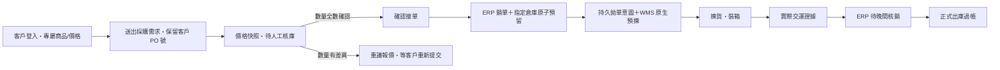

# Corely ERP 進銷存：第一階段實作與切換順序

建立：2026-09-23；狀態更新：2026-09-24。資料主權：**Corely ERP 管正式庫存帳**；WMS 管實物揀貨、裝箱與交運證據；ECOUNT 僅供查詢或經核准的會計用途。ERP 基礎功能已部署至 DEV；跨系統交運與核銷仍在隔離的 0% 流量候選進行配對試驗。**正式環境及實體倉儲流程尚未驗收。**

## 單據與狀態

目前 A→J 都有程式實作；其中 A→E 與採購成本已在 DEV 基礎版本驗證，ERP→WMS→交運→核銷正做隔離配對試驗，尚不能把程式存在視為跨系統出貨已驗收。裝箱完成不能充當交運或正式扣庫。對 WMS 管理的銷單，ERP 原有「整張銷單立即出庫」入口已加阻擋，正式出庫必須經交運證據與人工核銷。

| 單據／數量 | 建立時點 | 負責系統 | 已實作邊界 |
|---|---|---|---|
| 客戶採購需求／價格快照 | 客戶送出 | ERP | 保留客戶 PO 號、SKU、價格、稅額和提交冪等鍵；只供該客戶登入檢視；**尚非正式 `SalesQuotation`** |
| 人工核庫結果 | 業務或倉管確認 | ERP | 記錄逐行可供量、核對人、時間、交期與差異說明；不先扣庫 |
| 正式銷單與預留 | 人員確認接單 | ERP | 只准全數確認的需求；一筆 DB 交易內建單與預留，庫存不足全部回滾 |
| 拋單與預揀工作單 | 出貨人員送倉 | ERP→WMS | 保留 ERP 拋單意圖與原請求 ID；WMS 檢查來源逐商品數量、ERP 預留證據與簽章 |
| 實際交運與待核銷 | 倉庫確認交給物流或客戶 | WMS→ERP | WMS 保存箱件、數量、物流／提貨證據及持久 outbox；ERP 以獨立認證接收後，只建待人工核銷紀錄，不扣帳面庫存 |
| 正式出庫 | 人員逐行核對並核准 | ERP | 原交易內釋放該行預留、寫正式 OUT 及唯一過帳收據；可分次過帳，重送不重複扣庫 |
| 收貨運費試算 | 採購單收貨前 | ERP | 逐明細計費重量 × 每公斤費率 × 匯率，按重量分攤到貨品，保存操作人與成本快照 |
| 正式採購入庫成本 | 採購收貨 | ERP | 入庫與移動平均成本在同一交易；已保存的**暫估**運費計入成本，尚不產生實際運費會計憑證 |

## 本次可操作的入口

- 客戶：`/b2b/login`、`/b2b/catalog`、`/b2b/requests`、`/b2b/requests/:id`。客戶帳號與員工帳號分離；LINE 由業務自行貼受登入保護的連結，不自動發訊。
- 員工：`/sales/b2b` 管理外部帳號、發布商品、客戶專屬價、需求核庫與確認接單。供應商帳號可建檔、停用及重設密碼，操作另需採購公司存取與採購單建立權限；**供應商入口尚未開放**。
- 採購：既有採購單頁增加每行重量與運費試算／保存。`POST /purchase-orders/:id/landed-cost/preview` 只試算；`PUT /purchase-orders/:id/landed-cost` 在未收貨時保存。收貨後唯讀。
- 出貨：ERP 的「訂單拋轉」送至 WMS 原生接單 API。成功回執含預揀單、WMS 工作單與 WT 工作條碼；ERP 可連到 WMS `/corely-intakes/:id`。WMS 交運頁可保存實交數量與箱件證據，ERP `/inventory/handover-reconciliation` 逐行人工過帳。這條跨系統流程目前限配對 DEV 候選試驗，不能以穩定入口直接宣稱已可營運。
- 既有正式單據：`/sales/quotations` 可由員工獨立建立銷售報價，`/purchasing/orders` 可由員工獨立建立供應商採購單；兩者尚未與客戶採購需求及缺貨明細建立來源關聯或轉單動作。

第一版客戶入口限 TWD／5% 稅率與一般商品。確認接單前再次驗證商品條碼、非 SN 商品及同品牌 WMS 對照；商品或對照資料缺漏時拒絕接單，不留下無法送倉的預留。數量不符時保存差異，需與客戶重議並由客戶重新提交；尚未提供正式報價版本、客戶點選接受及由該報價轉銷單。LINE 僅由人員複製受登入保護的連結後自行傳送，沒有自動通知。供應商帳號目前可建、停用及重設密碼，但供應商登入入口與採購單查閱尚未開放。

## 進貨成本的具體口徑

每張採購單在第一次收貨前保存一次運費暫估。人員輸入各行**本次計費重量 kg**、運費幣別、原幣每公斤費率及換算公司本位幣的匯率。系統先算總運費，再按行重量比例分配；小數尾差按最大餘數分到明細，確保每行分攤加總等於總運費。收貨時以「商品本幣採購額＋行運費」更新移動平均成本；同 SKU 在一張單出現多行會合併計算，避免重複計價。估算記錄有建立／更新人及套用時間。

這一版不含一批海運合併多張 PO、分批到貨、材積重與最低收費、報關／關稅分攤、實際運費憑證及差額調整，也不把暫估直接當付款或可扣抵稅。這些要進下一版的「運輸批次＋收貨批次＋實際費用調整」模型。

## 交運與晚間核銷：目前實作及邊界

WMS 原生交運已在候選程式中保存來源訂單與行 ID、實際交運數量、SKU、箱號、物流或客戶提貨證據、操作人、時間及事件 ID；裝箱與交運是不同節點。持久 outbox 以原事件 ID 重送。ERP 驗證已確認的拋單、來源、權限、預留和逐行數量，將事件保存為待核銷；收到回執時**正式帳面尚未扣減**，可售量仍受原預留限制。此版交運限非 SN 一般商品；SN／批號交運核銷仍需後續設計與驗收。

ERP 工作台可按交運日、狀態與訂單／事件／SKU 搜尋，讓人員逐行比對箱件、實交量與銷單餘量。核准時以**出貨明細 ID** 的唯一收據，在同一交易中釋放該量預留、扣帳面庫存並寫流水；分次交運只過帳已核准數量，剩餘量仍保留預留，同一行重送不二次扣庫。這是逐行人工核銷，尚未提供整日晚間批次核准、專用差異佇列、剩餘預留取消／釋放或已過帳沖銷／退貨流程。

ERP 出貨明細、不可改寫的交運 inbox、過帳收據與 WMS outbox／簽章回傳均已在候選程式中。配對 DEV 候選維持 0% 流量；在 60＋40 分次交運、重播不重扣、失敗恢復及實際倉管操作驗收前，不應把候選流程當作正式出貨能力。

## 尚待補齊的單據閉環

1. **正式銷售報價**：從客戶採購需求建立有版次、有效期、價格／交期及核准紀錄的正式 `SalesQuotation`；客戶登入後接受或拒絕指定版本，再由已接受版本轉銷單。缺貨或改價須產生新版、重新取得客戶同意，保留原 PO 與報價來源。
2. **缺貨到供應商採購**：由核庫差異產生採購建議，保留需求行與 SKU 來源；採購人員選供應商、成本、數量、交期並確認後才建立 `PurchaseOrder`，避免直接把客戶需求當成對供應商的承諾。
3. **進貨與成本後續**：支援運輸批次、多 PO／分批到貨、材積或最低收費、關稅與實際運費差額及經核准的會計憑證；目前的暫估運費只入移動平均成本，沒有實際運費分錄。
4. **倉儲例外與對帳**：補整日批次審核、差異處理、未交餘量取消、退貨／沖銷及 SN／批號追溯，再做現場掃碼、列印、物流交接與倉管夜間核對驗收。

## 上線順序與驗收

1. **DEV 基礎版本已部署**：ERP API `corely-erp-api-dev-b2b-a75132f0b6b3-c`、web `corely-erp-dev-b2b-a75132f0b6b3-f` 各接 100% DEV 流量；三項 ERP migration `20260923080000_b2b_customer_portal`、`20260923090000_purchase_landed_cost`、`20260923100000_wms_handover_reconciliation` 已在 DEV 套用並核對。合成資料已驗證客戶 A/B 隔離、登入、專屬價、提交需求、人工核庫、採購收貨與暫估運費成本。這不等於正式使用者驗收。
2. **配對 WMS 候選試驗中**：ERP API `corely-erp-api-dev-pairfix-a75132f0-0923`、web `corely-erp-dev-pair-a75132f0-0923`、WMS `corely-wms-dev-pair-a75132f0-0923-config` 均為 0% 流量標記候選；穩定 WMS 仍由 `corely-wms-dev-entry-audit2-0923` 接 100% DEV 流量。需要完成同一張訂單的安全重送、原生預揀／揀貨／裝箱、60＋40 交運、兩筆 outbox 交付、人工逐行核銷，以及每一步庫存和收據讀回。WMS 發送器在試驗前維持停用。
3. **正式單據與資料準備**：完成正式報價、缺貨採購轉單及供應商入口前，這些流程仍由人員分別在既有單據頁操作。正式切換前核對客戶／供應商主檔、價格、SKU 條碼、公司與倉庫、WMS 品牌對照及具名人員 grants，不依 Email 或姓名自動對應。
4. **擴大驗收**：除合成 60＋40 外，還需測重複事件／丟 ACK、跨日、錯品或逾額、兩人併發、失敗回滾、舊 ERP／ECOUNT 來源切換與退貨；最後在現場驗收實際掃碼、列印、交運與晚間核對。DEV 與正式需各自保留部署及核銷證據。

設定至少需 `B2B_PORTAL_ENABLED=true`、`WMS_HANDOVER_ENABLED=true`、ERP→WMS 的 URL／RS256 金鑰與 issuer/audience、WMS 的 ERP 公鑰／明確 grants，以及 ERP SKU→WMS 品牌對照；使用既有密鑰流程，不把金鑰寫入程式庫。WMS 原生 migration 與 ERP migration 須分別核對 checksum 與資料庫版本。DEV、正式、歷史切換及實體驗收各自出具證據，不以本機 build、0% 候選或合成測試代替。
